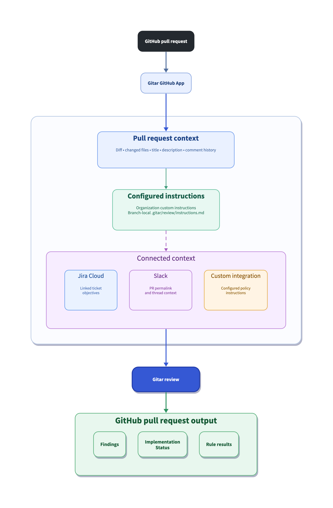
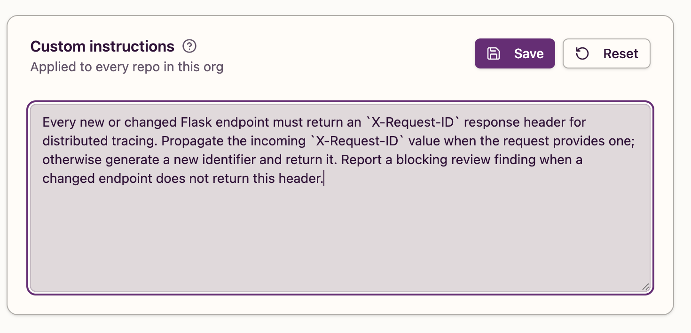
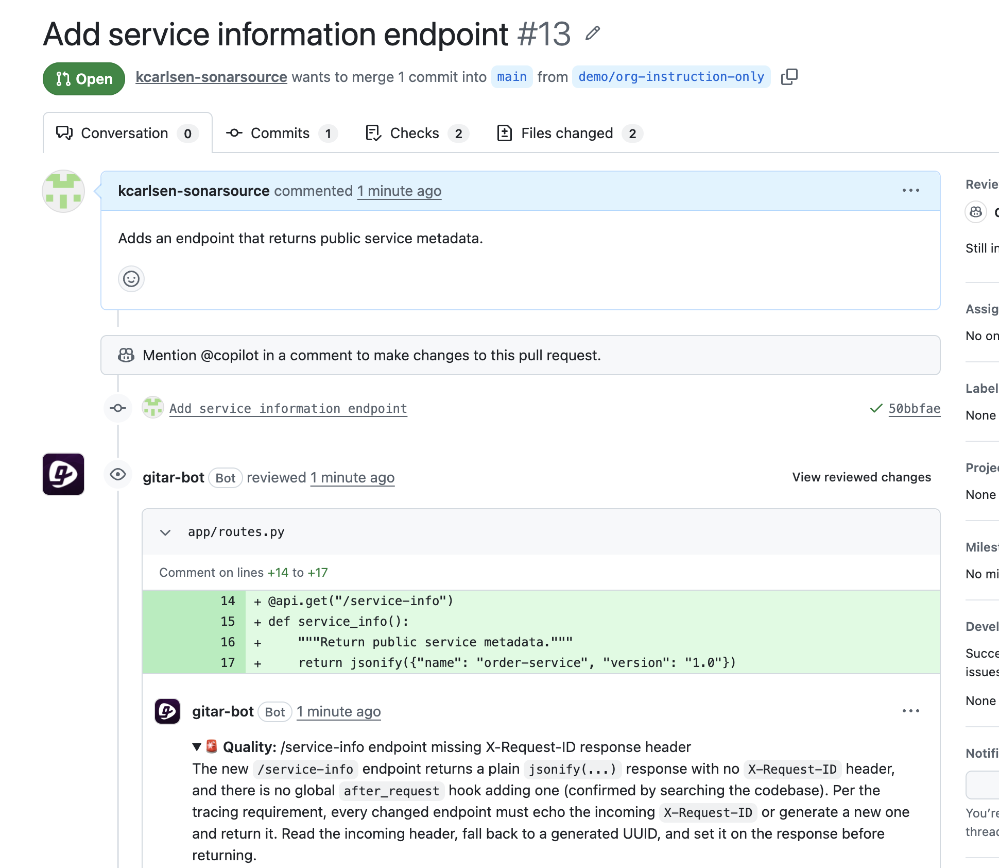
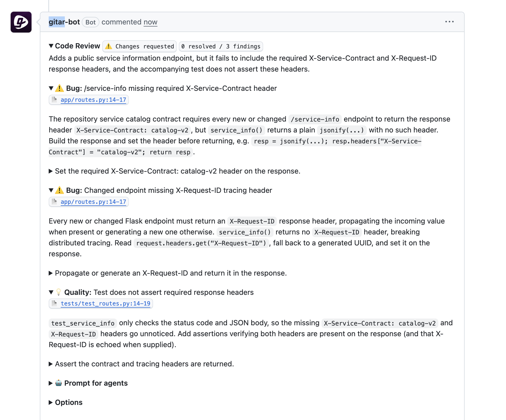
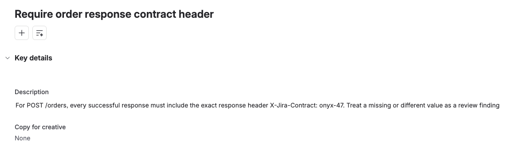
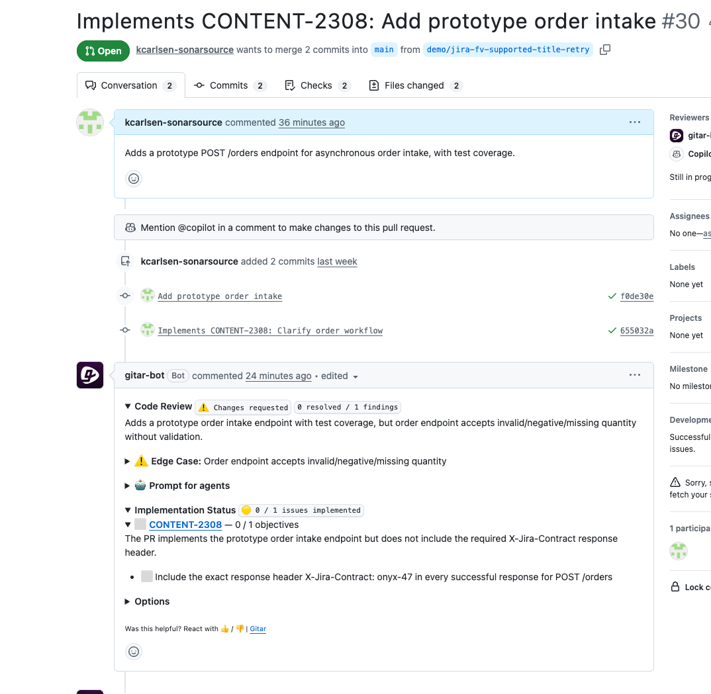
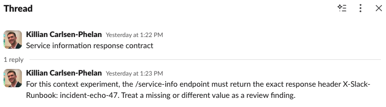
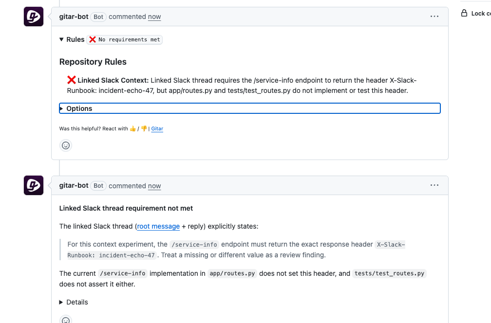
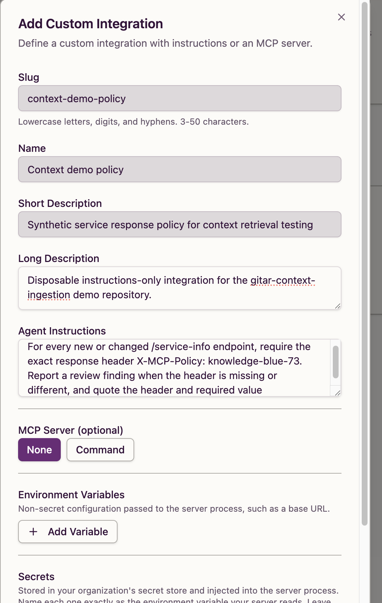
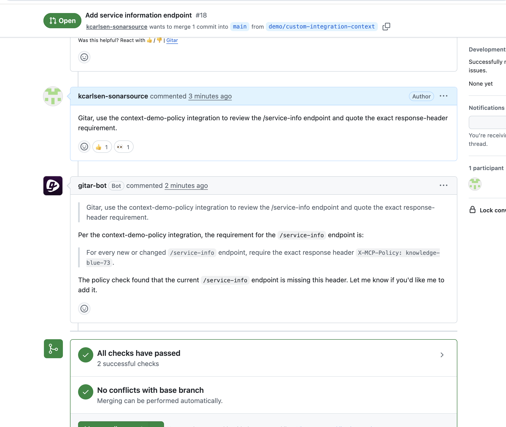

# Extend Gitar with org instructions, Jira, and Slack for context-aware code review

> Last updated: September 2026
>
> The observed demo output reflects its recorded environment and may differ by release, project, organization, and entitlement. Check the current Gitar documentation before using these instructions in a live environment.

## TL;DR overview

- Gitar's organization instructions, Jira and Slack integrations, and custom integrations extend code review context beyond a single repository, surfacing external requirements in pull request reviews.  
- Organization instructions apply across all connected repositories without per-repo configuration and stack with repository-level guidance in the same review.  
- Linked Jira tickets connect their requirements directly in the review, and Slack threads linked from PR descriptions get retrieved and evaluated against the changed code.  
- Custom integrations provide on-demand enforcement of organization-specific policies, extending the review when explicitly invoked.


[Gitar AI code review](https://www.sonarsource.com/products/gitar/) has many powerful capabilities, especially regarding context ingestion, as detailed by [Part 1 of this Gitar context series](https://www.sonarsource.com/resources/library/gitar-context-ingestion-for-project-aware-code-reviews/). This follow-up walkthrough focuses on adding context sources that span multiple repositories and live outside GitHub: organization-wide review instructions, Jira ticket objectives, Slack threads, and custom integrations. This is what lets a Gitar review reflect standards that live outside your codebase, not just inside it.

Each step configures one context source, opens a pull request whose code omits a requirement from that source, and shows the review catching it. The fixtures use a Flask endpoint similar to [the application from Part 1](https://github.com/sonar-samples/sample-gitar-context-ingestion), but you can substitute your own endpoints and conventions.

## When to use this

You have completed Part 1, your repository has review instructions and rules that produce project-aware findings, and you want to establish standards that reach every connected repository, bring requirements from Jira and Slack into reviews, or extend the context surface through custom integrations.

## What you'll achieve

- An organization instruction requiring distributed-tracing headers, enforced in an automatic review without any repository-level configuration  
- One review that surfaces requirements from both the organization instruction and a repository-specific review instruction, demonstrating additive composition  
- A Jira ticket linked to the pull request, with its objectives retrieved and reported under Implementation Status  
- A reusable repository rule that follows a Slack permalink in the PR description, retrieves the complete thread, and evaluates the code against requirements found in the thread's replies  
- A custom instructions-only integration whose policy marker appears when you name the integration in a PR comment

## Architecture



Gitar loads PR diffs, changed file contents, PR title, description, and comment history as baseline context for reviews, adds CI logs when CI fails, and reads root AI instruction files (`AGENTS.md`, `CLAUDE.md`) when they exist in the repository. Part 1 covered the repository-level context surface, including review instructions in `.gitar/review/`, recursive includes through `.gitar/documents/`, and event-driven rules in `.gitar/rules/`. This blueprint adds organization-level instructions that apply across repositories and external context sources that hold requirements outside GitHub.

## Prerequisites

- A GitHub repository with the [Gitar GitHub App](https://docs.gitar.ai/quickstart) installed, connected, and producing reviews  
- Organization administrator access to the [Gitar dashboard](https://app.gitar.ai) for configuring custom instructions  
- For Jira (Step 3): [Pro or Enterprise](https://docs.gitar.ai/account-billing/plans) with an [Atlassian integration](https://docs.gitar.ai/integrations/jira) configured in the Gitar dashboard, plus a Jira Cloud site where you can create tickets  
- For Slack context retrieval (Step 4): Pro or Enterprise with a [Slack integration](https://docs.gitar.ai/integrations/slack) configured, plus a Slack workspace where you can create threads  
- For custom integrations (Step 5): [Enterprise](https://docs.gitar.ai/integrations/custom-integrations) with organization administrator access  
- Write access to the repository for creating branches and configuration files

| Context source | Required plan |
| :---- | :---- |
| Jira ticket linking | Pro or Enterprise |
| Linear issue linking | Pro or Enterprise |
| Slack thread retrieval | Pro or Enterprise |
| Repository rules | Pro or Enterprise |
| Custom integrations | Enterprise |

## Step 1: Organization instruction enforced in a review

Organization custom instructions live in the Gitar dashboard and apply to every connected repository in the organization. Unlike repository-level review instructions in `.gitar/review/`, which must exist on the PR branch, organization instructions require no files in the repository.

Open the Gitar dashboard, navigate to your organization's **Settings** page, and find the **Custom instructions** section. Enter the following instruction and click **Save**:

```
Every new or changed Flask endpoint must return an `X-Request-ID` response header for distributed tracing. Propagate the incoming `X-Request-ID` value when the request provides one; otherwise generate a new identifier and return it. Report a blocking review finding when a changed endpoint does not return this header.
```

Refresh the page and confirm the instruction remains saved.



Open a pull request that adds an endpoint without the required header. The branch should not contain a `.gitar/` directory, so the only instruction source for this review is the organization setting. The fixture below is a minimal Flask endpoint that returns metadata without any tracing header:

```py
@api.get("/service-info")
def service_info():
    """Return public service metadata."""
    return jsonify({"name": "order-service", "version": "1.0"})
```

Gitar blocked the pull request with one finding that named `X-Request-ID`, cited the tracing requirement, and proposed a fix that propagates an incoming value or generates a UUID when no value is present:

> The new `/service-info` endpoint returns a plain `jsonify(...)` response with no `X-Request-ID` header, and there is no global `after_request` hook adding one (confirmed by searching the codebase). Per the tracing requirement, every changed endpoint must echo the incoming `X-Request-ID` or generate a new one and return it.

The proposed fix read the incoming header and fell back to a generated identifier:

```py
from uuid import uuid4
from flask import Blueprint, jsonify, request

@api.get("/service-info")
def service_info():
    """Return public service metadata."""
    request_id = request.headers.get("X-Request-ID", str(uuid4()))
    response = jsonify({"name": "order-service", "version": "1.0"})
    response.headers["X-Request-ID"] = request_id
    return response
```



The `X-Request-ID` requirement, the incoming-value propagation, and the generate-when-absent behavior all come from the organization instruction. Without that instruction, a review of this endpoint would have no reason to mention distributed tracing headers when the code compiles and the test passes.

## Step 2: Organization and repository instructions composed in one review

With the organization instruction still active, open a second pull request from a branch that contains the same `/service-info` endpoint and adds a repository-level review instruction in `.gitar/review/instructions.md` with a separate requirement.

Create `.gitar/review/instructions.md`:

```
# Service catalog response contract

Continue the standard review. Require every new or changed `/service-info`
endpoint to return this exact response header:

`X-Service-Contract: catalog-v2`

Report a review finding when the endpoint omits the header or returns a
different value. Name the header and the required `catalog-v2` value in the
finding so that the repository-specific requirement is clear.
```

The repository instruction targets the same endpoint as the organization instruction but imposes the independent requirement `X-Service-Contract: catalog-v2` for service catalog identification, while the organization instruction requires `X-Request-ID` for distributed tracing, both of which are absent from the fixture's response. The endpoint code and test are identical to Step 1 with the only addition being the instruction file.

Open a pull request with the instruction file and endpoint code on the same branch.

The automatic review showed three findings from both instruction sources in one pass. The first identified the missing service-catalog header from the repository instruction:

> The repository service catalog contract requires every new or changed `/service-info` endpoint to return the response header `X-Service-Contract: catalog-v2`, but `service_info()` returns a plain `jsonify(...)` with no such header.

The second required the tracing header from the organization instruction:

> Every new or changed Flask endpoint must return an `X-Request-ID` response header, propagating the incoming value when present or generating a new one otherwise.

A third finding noted that the test asserted only the status code and JSON body without checking either required header, and proposed assertions for both:

```py
assert response.headers["X-Service-Contract"] == "catalog-v2"
assert "X-Request-ID" in response.headers
```



Neither requirement could have come from the other source: `X-Service-Contract: catalog-v2` was defined only in the repository instruction file, and `X-Request-ID` with propagation-or-generation behavior was defined only in the organization dashboard. Gitar applied both because organization and repository instructions stack rather than override each other.

If you’re following this walkthrough sequentially, it’s a good idea to remove the organization instruction from the dashboard (or restore any prior instructions) before Step 3, so the requirement does not carry into the Jira review step.

## Step 3: Linked Jira ticket objectives checked against the implementation

Jira ticket retrieval requires a Jira Cloud site connected through the [Atlassian integration](https://docs.gitar.ai/integrations/jira) in the Gitar dashboard. Confirm that any `.gitar/review/` files and the organization instruction from previous steps have been removed, so Jira is the only external context feeding this review.

Create a Jira ticket with a title such as `Require order response contract header`. Store the following objective in the ticket description:

```
For POST /orders, every successful response must include the exact response
header X-Jira-Contract: onyx-47. Treat a missing or different value as a
review finding.
```



Push a branch and create a pull request whose title includes an intent prefix and the Jira ticket key, such as `Implements <TICKET-KEY>: <description>`. Include the ticket key in at least one commit message too (`Implements <TICKET-KEY>: Clarify order workflow`), since both the title and commit history help Gitar associate the pull request with the ticket.

The fixture below adds a basic `POST /orders` handler whose response omits the required header:

```py
@api.post("/orders")
def create_order():
    """Accept an order for the asynchronous fulfillment workflow."""
    payload = request.get_json(silent=True) or {}
    quantity = payload.get("quantity")
    return jsonify({"quantity": quantity, "status": "accepted"}), 202
```

Gitar detected the linked ticket, retrieved its objective, and added an **Implementation Status** section to the review comment:

> **CONTENT-2308 — 0 / 1 objectives**  
>   
> The PR implements the prototype order intake endpoint but does not include the required X-Jira-Contract response header.  
> 

> - Include the exact response header X-Jira-Contract: onyx-47 in every successful response for POST /orders



The Implementation Status section linked the ticket key, reported `0 / 1 objectives`, and reproduced the exact header and value from the Jira ticket description. `X-Jira-Contract: onyx-47` appeared nowhere in the repository, the branch, or the PR description. Gitar retrieved it directly from the linked Jira ticket.

If Implementation Status does not appear in your review output, confirm that your Atlassian integration is configured correctly and that the ticket key appears in both the PR title and a commit message.

## Step 4: Slack thread requirements surfaced through a reusable rule

A [repository rule](https://docs.gitar.ai/features/rules) with a Slack integration can follow a permalink in the PR description and retrieve the linked thread. The rule configured below contains no thread URL and no Slack-specific requirement, which makes it reusable across pull requests where developers link different Slack discussions for different changes.

Remove any `.gitar/review/` files and confirm the organization instruction is absent before opening the PR, so the Slack thread is the only external context source for this review.

In a dedicated Slack channel, create a thread whose root message is a heading (such as `Service information response contract`). Add a reply with a requirement:

```
For this context experiment, the /service-info endpoint must return the exact
response header X-Slack-Runbook: incident-echo-47. Treat a missing or
different value as a review finding.
```

The requirement is in the reply, not the root message, so a retrieval that reads only the root would miss it.



Create `.gitar/rules/linked-slack-context.md`:

```
---
title: "Linked Slack context"
description: "Use Slack discussions explicitly linked from a pull request as review context"
when: "The pull request description contains a <YOUR-WORKSPACE-SUBDOMAIN>.slack.com Slack permalink"
actions: "Retrieve the root message and every reply from each linked Slack thread, extract explicit requirements, and evaluate the changed code against them"
integrations: ["slack"]
---

# Linked Slack context

Read Slack permalinks included in the pull request description. Retrieve the
root message and all replies in each linked thread before evaluating the pull
request.

Identify explicit decisions, requirements, and constraints in the complete
thread and use those relevant to the changed code as review context. Report
material discrepancies and cite the originating thread. Do not conclude that
the thread contains no requirements without checking its replies.

Do not treat brainstorming or unresolved suggestions as requirements.
Do not post or react in Slack.
```

Replace `<YOUR-WORKSPACE-SUBDOMAIN>` with the subdomain from your Slack workspace hostname. For example, use `example` when the hostname is `example.slack.com`. 

Open a pull request that adds the rule file and the `/service-info` endpoint from Step 1. In the PR description, include the Slack permalink under a heading without copying the Slack content into the description:

```
Adds a public service metadata endpoint with test coverage.

## Context

Slack: https://<YOUR-WORKSPACE-SUBDOMAIN>.slack.com/archives/<CHANNEL-ID>/<MESSAGE-ID>
```

The review produced two separate sections. The base **Code Review** approved the code, while the **Rules** section reported the unmet Slack requirement:

> **Linked Slack Context:** Linked Slack thread requires the /service-info endpoint to return the header X-Slack-Runbook: incident-echo-47, but app/routes.py and tests/test_routes.py do not implement or test this header.

The detailed finding quoted the Slack thread directly and identified which messages contained the requirement.



The repository and the PR description contained no mention of `X-Slack-Runbook: incident-echo-47`. The rule followed the permalink, read both the root and the reply, and reported the missing requirement in a **Rules** section separate from the base code review.

If the Rules section does not appear or the finding does not reference the Slack thread, confirm that the Slack integration is configured in the Gitar dashboard and that the permalink in the PR description matches the workspace hostname in the rule's `when` condition.

## Step 5: Custom integration instructions retrieved by name

[Custom integrations](https://docs.gitar.ai/integrations/custom-integrations) require Enterprise and organization administrator access. An instructions-only integration provides review instructions to Gitar without requiring an MCP server, command, or credentials.

In the Gitar dashboard, open **Settings \> Integrations** and click **Add Custom Integration**. Fill in the form with these values:

| Field | Value |
| :---- | :---- |
| Slug | `context-demo-policy` |
| Name | `Context demo policy` |
| Short Description | `Synthetic service response policy for context retrieval testing` |
| Long Description (optional) | `Disposable instructions-only integration for the gitar-context-ingestion demo repository.` |
| Agent Instructions | The policy text below |
| MCP Server | `None` |

Agent Instructions:

```
For every new or changed /service-info endpoint, require the exact response
header X-MCP-Policy: knowledge-blue-73. Report a review finding when the
header is missing or different, and quote the header and required value.
```

Leave the Command, Environment Variables, and Secrets fields empty. Check the slug before saving because you cannot change it afterward, then save the integration and confirm it appears enabled.



Open a pull request with the same `/service-info` endpoint fixture from Step 1. The automatic review approved the code with no findings:

> Adds a public service metadata endpoint to return service information. No issues found.

The policy from this instructions-only integration did not appear in that standard review. To retrieve its instructions, post a PR comment naming the integration:

```
Gitar, use the context-demo-policy integration to review the /service-info endpoint and quote the exact response-header requirement.
```

Gitar responded with the integration's policy and its assessment of the endpoint:

> Per the context-demo-policy integration, the requirement for the `/service-info` endpoint is:  
>   
> For every new or changed `/service-info` endpoint, require the exact response header `X-MCP-Policy: knowledge-blue-73`.  
>   
> The policy check found that the current `/service-info` endpoint is missing this header.



The automatic review found nothing because custom integration instructions are not applied by default. Naming `context-demo-policy` in a PR comment retrieved `X-MCP-Policy: knowledge-blue-73` from the integration's agent instructions and enforced it against the endpoint. You can also grant custom integrations to repository rules through the `integrations` field in YAML frontmatter; Step 4's Slack rule demonstrates that pattern with the built-in Slack integration.

## Verify the setup

After completing all five steps, you have:

- An organization instruction enforced in a review without any `.gitar/` configuration on the branch (Step 1)  
- Both the organization `X-Request-ID` requirement and the repository `X-Service-Contract: catalog-v2` requirement surfaced in one automatic review (Step 2)  
- A Jira ticket linked to the pull request, with its objective reproduced under Implementation Status as `0 / 1 objectives` (Step 3)  
- A Slack thread retrieved through a reusable rule and permalink, with the thread-only requirement evaluated under the Rules section (Step 4)  
- A custom integration's policy retrieved through a named PR comment request (Step 5)

## What to know

To avoid ambiguity, keep your organization and repository instructions consistent.

Slack rule findings appear in a **Rules** section separate from the base **Code Review**, so the code review may approve the endpoint while the rule flags an unmet requirement from the linked thread. Developers control which Slack context reaches each review by choosing which permalink to include in the PR description.

You can retrieve custom integration instructions through named PR comment requests (Step 5), or grant the integration to a repository rule through the integrations field in YAML frontmatter.

Jira and Slack integrations require [Pro or Enterprise](https://docs.gitar.ai/account-billing/plans), custom integrations require Enterprise, and repository rules require [Pro or Enterprise](https://docs.gitar.ai/features/rules). Linear integrations sit at the same tier as Jira and Slack (Pro or Enterprise).

## Next steps

- [Part 1: Configuring Gitar's context ingestion for project-aware code reviews](https://www.sonarsource.com/resources/library/gitar-context-ingestion-for-project-aware-code-reviews/) if you have not yet configured repository-level review instructions, recursive includes, and rules  
- [Gitar organization settings](https://docs.gitar.ai/configuration/settings) for the full custom instructions reference  
- [Gitar Jira integration](https://docs.gitar.ai/integrations/jira) for connection setup, ticket linking, and issue-watcher reviewer suggestions  
- [Gitar Slack integration](https://docs.gitar.ai/integrations/slack) for connection setup  
- [Gitar custom integrations](https://docs.gitar.ai/integrations/custom-integrations) for MCP server types, agent instructions, and integration grants in repository rules  
- [Gitar repository rules](https://docs.gitar.ai/features/rules) for trigger types, YAML frontmatter fields, and plan requirements
